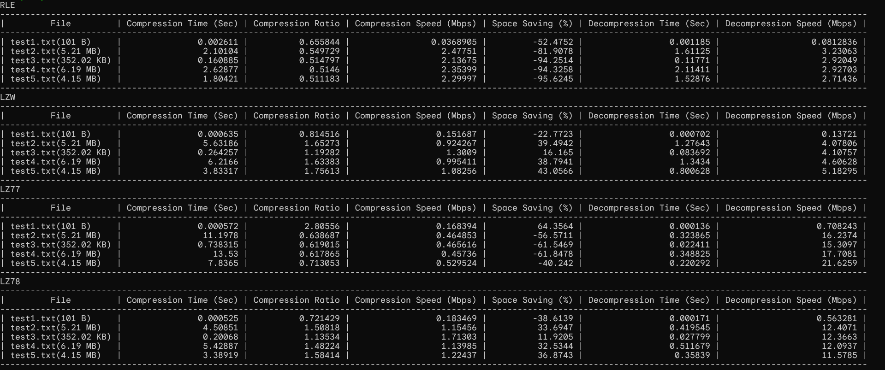
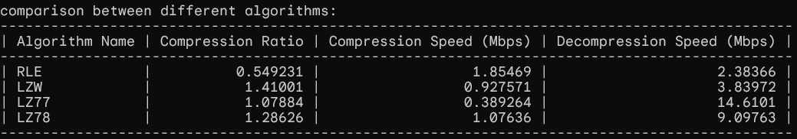

### Exercise for CERN-HSF GSoC 2024 : Lossless compression of raw data for the ATLAS experiment at CERN

Name - Aditya Mayukh Som

### Description

- Implemented C++ functions to (de)compress input data using 'Run-Length encoding' and 'Dictionary coder'. Implemented algorithms are:
- Implemented C++ functions to (de)compress input data using 'Run-Length encoding' and 'Dictionary coder'. Implemented algorithms are:
  1. Run-Length encoding
  2. LZW
  3. LZ77
  4. LZ78
- Performance: Comparision of the methods in terms of Compression ratio, (de)compression speed and memory usage.

### A briefing about the Algorithms

The following sections give a brief overview about the compression algorithms.

1. #### Run Length Encoding

    The Run-Length Encoding (RLE) algorithm implemented here is a simple compression technique that compresses data by representing consecutive repeated symbols with a count and the symbol itself. Conversely, during decompression, it expands the encoded data back to its original form by repeating the symbols according to the count provided.

2. #### LZW

    The Lempel-Ziv-Welch (LZW) algorithm implemennted here is a lossless data compression algorithm. It operates by replacing repetitive sequences of symbols (such as characters in a text file) with references to a dictionary of previously encountered sequences. LZW achieves compression by exploiting redundancy in the input data, effectively representing repetitive sequences with shorter codes, thereby reducing the overall size of the data.

3. #### LZ77

    The LZ77 algorithms implemented here is a dictionary-based, lossless compression algorithm widely used in various compression utilities. LZ77 achieves compression by replacing repeated occurrences of data with references to a single copy of that data existing earlier in the uncompressed data stream.

4. #### LZ78

    The LZ78 compression algorithm implemented here is another widely-used dictionary-based, lossless compression algorithm. LZ78 algorithm achieves compression by replacing repetitive substrings with references to previously encountered phrases.

### Local Setup

To locally build the executable, you need to have `clang` toolchain and `make` available. This build uses `c++17` `std::filesystem` features although core compression algorithms do not use them. To build the executable, run -

```sh
make
```

Then to run the algorithm, use -

```sh
./encoder filename1.ext filename2.ext filename3.txt
```

The core algorithms are stored inside `src/algorithm` which can be used separately from the existig code by simply copy pasting them into other projects.

**Note:** Files need to reside inside `./original` directory where `./encoder` is run to execute the currently implemented main function. Compression algorithms take input and output paths as parameter, hence to use them in other projects, there is no need to store input files inside `./original` directory.
The core algorithms are stored inside `src/algorithm` which can be used separately from the existig code by simply copy pasting them into other projects.

**Note:** Files need to reside inside `./original` directory where `./encoder` is run to execute the currently implemented main function. Compression algorithms take input and output paths as parameter, hence to use them in other projects, there is no need to store input files inside `./original` directory.

### Benchmarking And Comparison

Benchmarking done on AMD Ryzen 7 5700U With Raedon Graphics, 1800MHz, 8 Cores, 16GB RAM

```sh
Compression Ratio = Uncompressed File Size / Compressed File Size
Compression Speed = Input File Size / Compression Time
Decompression Speed = Decompressed File Size / Decompression Time
```

#### Benchmarks



#### Comparison




### Acknowledgements

This project uses [Variadic Table](https://github.com/friedmud/variadic_table) for pretty printing the tables in terminal and [Memory Monitor](https://github.com/mpetri/mem_monitor) for memory profiling.
